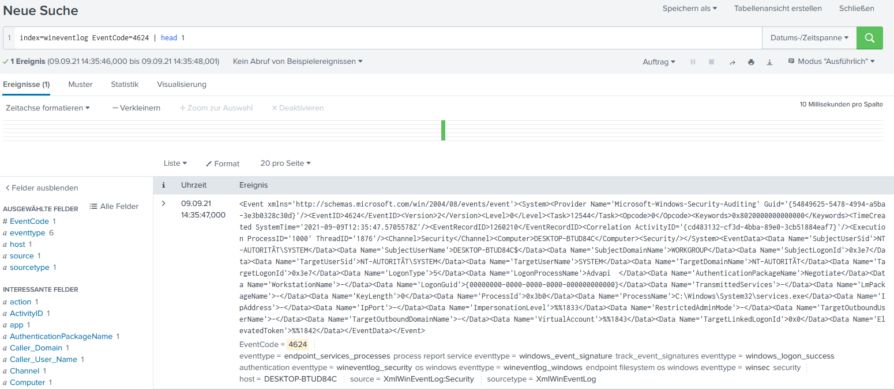
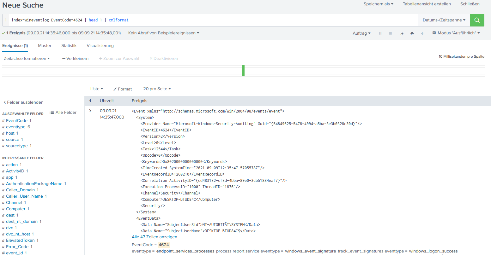

# TA-xmlformatter
## Description
This app provides a custom streaming command to format XML based events/fields.

## How to use
By default the search command uses the raw field for input & output
```
[your search] | xmlformat 
```

But you can specify them if you like:

```
[your search] | xmlformat infield=my_unformatted_xml_blob_field outfield=some_field_humans_can_read 
```



